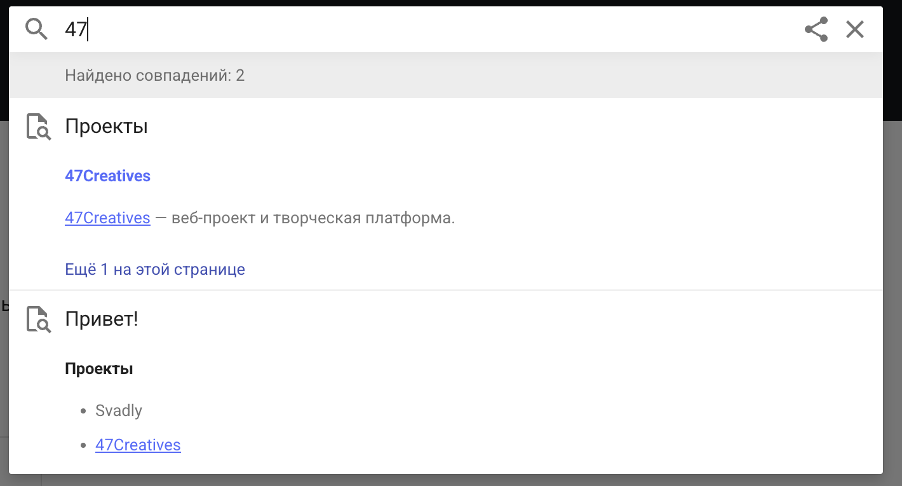
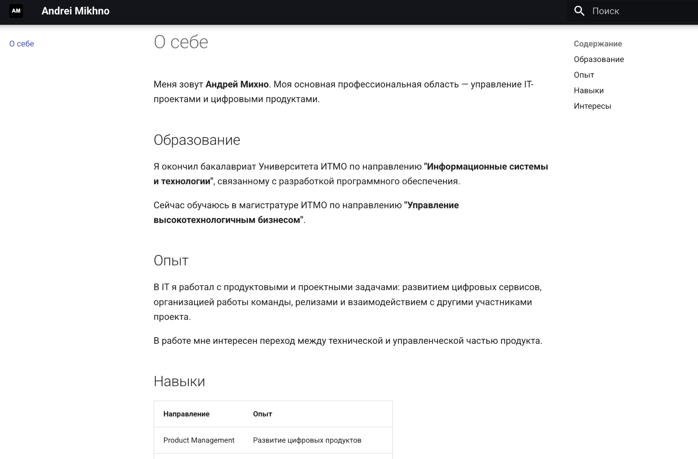
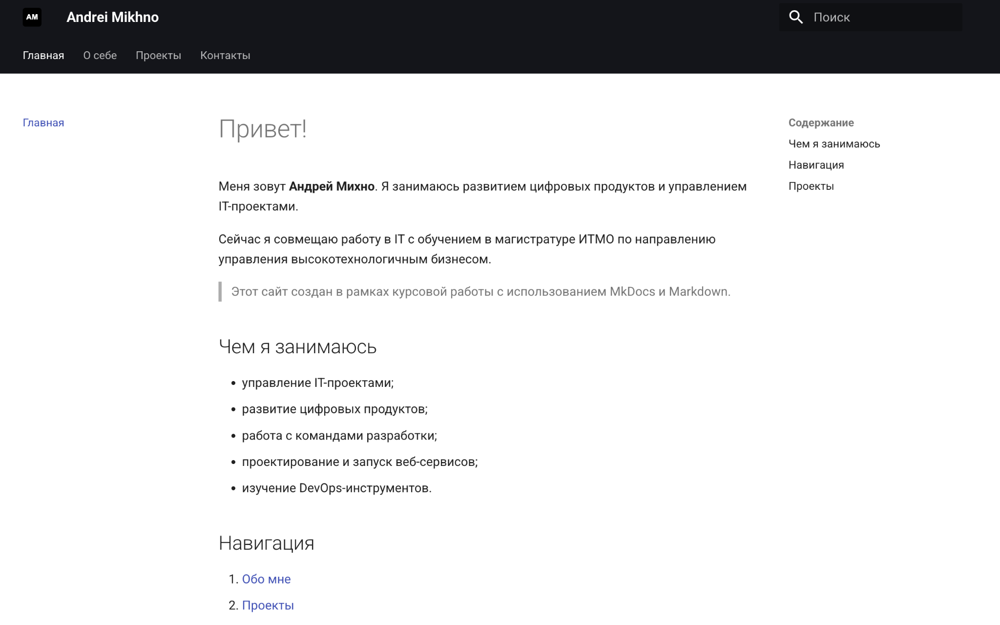
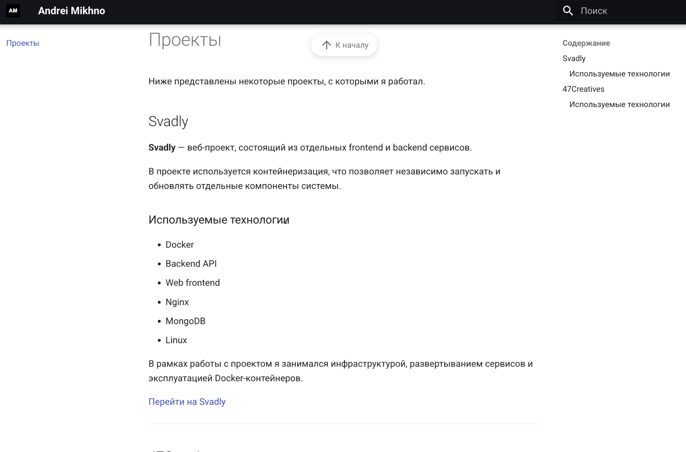
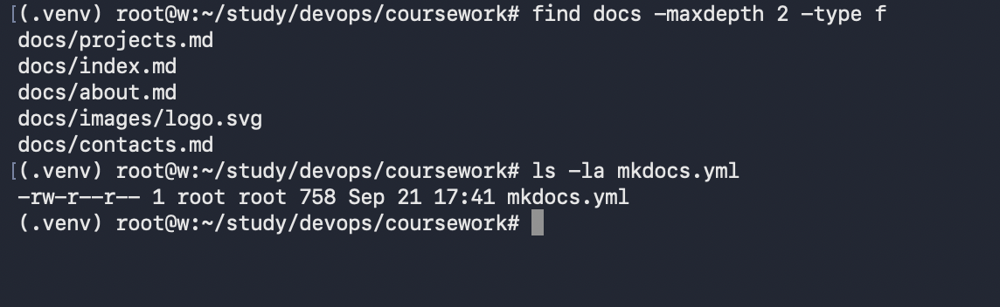
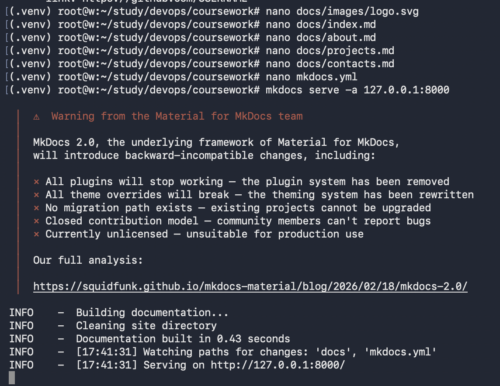
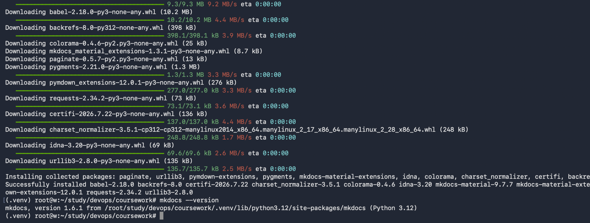

# Отчет по курсовой работе студента группы U4225 Михно Андрея
Студент: Mikhno Andrei  
Lab: Coursework  
Date of create: 16.09.2026  
Date of finished: -

## Цель работы

Создать персональный сайт с использованием MkDocs и языка разметки Markdown, настроить тему Material, навигацию, поиск и подготовить статическую версию сайта.

## Ход работы

### 1. Установка MkDocs и темы Material

Для выполнения курсовой работы было создано отдельное виртуальное окружение Python. В него были установлены MkDocs и тема Material. После установки была выполнена проверка версии MkDocs.

### 2. Создание проекта

В отдельной директории был создан новый проект MkDocs. После инициализации появились основной конфигурационный файл `mkdocs.yml` и директория `docs`. Дополнительно были подготовлены страницы «О себе», «Проекты», «Контакты» и папка для изображений.

### 3. Настройка конфигурации

В файле `mkdocs.yml` были заданы название сайта, описание, автор, тема Material, цветовая схема, навигация и поиск. Также был подключен логотип и добавлены ссылки на социальные сети.

### 4. Запуск локального сервера

После создания страниц и настройки конфигурации был запущен встроенный сервер MkDocs. Сайт успешно собрался и стал доступен локально на порту 8000.

Во время запуска Material for MkDocs вывел предупреждение о будущих изменениях MkDocs 2.0, однако текущая версия сайта была собрана и запущена корректно.

### 5. Главная страница

На главной странице размещена краткая информация обо мне, основные направления работы, навигация и список проектов. Также используется логотип и верхнее меню Material.

### 6. Страница «О себе»

На странице «О себе» размещена информация об образовании, профессиональном опыте, навыках и интересах. Для структурирования данных используется таблица.

### 7. Страница «Проекты»

В разделе проектов были добавлены Svadly и 47Creatives. Для каждого проекта указано краткое описание и список используемых технологий.

### 8. Страница «Контакты»

На отдельной странице размещены основные способы связи, ссылки на Telegram и GitHub, а также контактная информация.

### 9. Проверка поиска

Встроенный поиск темы Material был протестирован на содержимом сайта. Поисковая строка корректно находит совпадения на разных страницах.

### 10. Сборка статического сайта

После проверки страниц была выполнена финальная сборка сайта. MkDocs создал директорию `site` со статическими HTML-файлами, ресурсами, поисковым индексом и sitemap.

### 11. Проверка исходной структуры

В конце была проверена структура исходных файлов проекта. В директории `docs` присутствуют все основные страницы сайта и логотип, а в корне находится конфигурационный файл `mkdocs.yml`.

## Результат работы

В результате курсовой работы был создан персональный сайт на MkDocs с использованием темы Material. Сайт содержит четыре основные страницы: главную, «О себе», «Проекты» и «Контакты».

На сайте настроены навигация, поиск, логотип, цветовая схема и различные элементы Markdown. Также была выполнена финальная сборка статической версии сайта.

## Вывод

В ходе работы были изучены основные возможности MkDocs и темы Material. Был создан и настроен многостраничный персональный сайт, добавлен контент в Markdown, проверена работа навигации и поиска, а также выполнена сборка готовых статических файлов.
