**# Отчет по Lab1 студента группы U4225 Михно Андрея**
Студент: Mikhno Andrei  
Lab: Lab0  
Date of create: 11.09.2026  
Date of finished: -

## Цель работы

Изучить основные принципы работы с Docker: запуск и остановку контейнеров, работу с готовыми образами, просмотр логов, подключение к контейнеру и использование Docker Volumes для хранения данных.

## Среда выполнения

Лабораторная работа выполнялась не на локальном компьютере, а на арендованном виртуальном сервере под Ubuntu. На сервере уже был установлен Docker и в контейнерах работали собственные приложения, поэтому повторную установку Docker выполнять не требовалось.

Такой вариант был выбран для того, чтобы выполнять задания в реальном окружении и одновременно увидеть, как Docker используется на практике для размещения нескольких сервисов на одном сервере.

Перед началом работы я подключился к серверу по SSH и проверил установленную версию Docker:


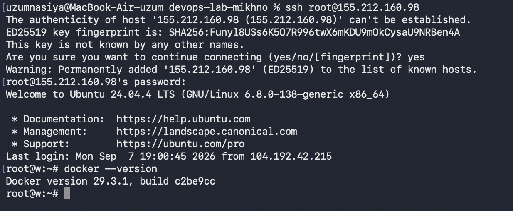

На сервере уже были запущены контейнеры backend, frontend, nginx и MongoDB. Для лабораторной работы использовались отдельные контейнеры с именами `lab1-*`, чтобы не затронуть работающие приложения.

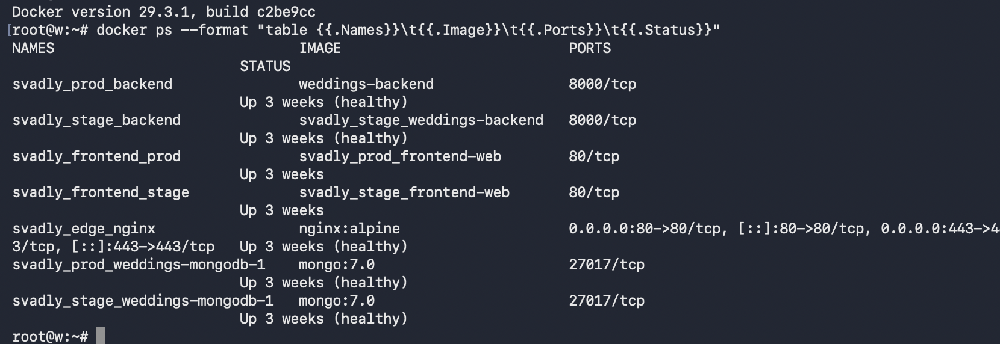

## Ход работы

### 1. Проверка работы Docker

Для проверки корректной работы Docker был запущен стандартный тестовый контейнер:

Так как образ `hello-world` отсутствовал локально, Docker автоматически скачал его из Docker Hub и запустил контейнер.

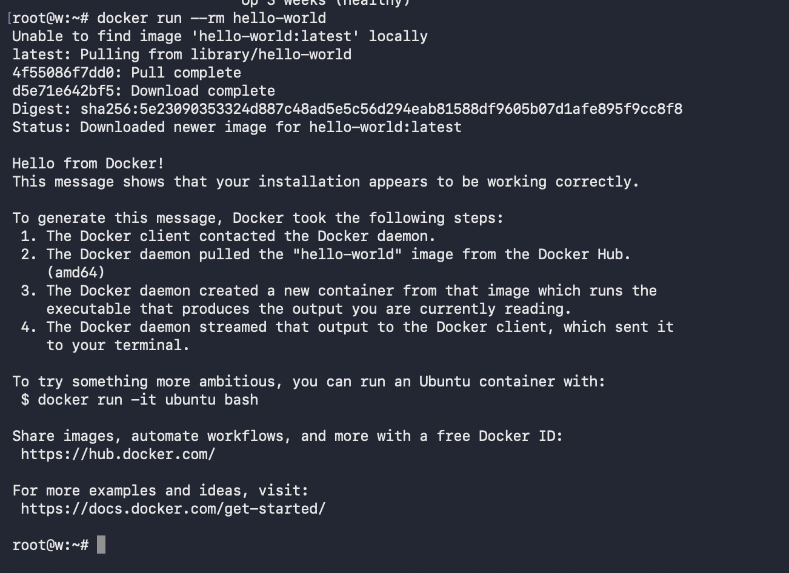

После этого были выполнены базовые команды Docker. Команда `docker images` показывает доступные локальные образы, `docker ps` — только запущенные контейнеры, а `docker ps -a` — все контейнеры, включая остановленные.

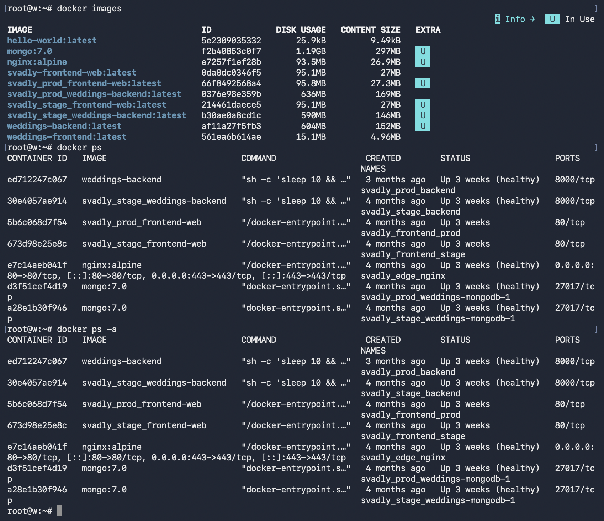

### 2. Работа с готовым образом Ubuntu

Был использован образ `ubuntu:latest`. Контейнер запускался в интерактивном режиме:

```bash
docker run -it --name lab1-ubuntu ubuntu:latest bash
```

После запуска я проверил информацию об операционной системе:

```bash
cat /etc/os-release
```

Затем был обновлен список пакетов:

```bash
apt update
```

и установлен пакет `curl`:

```bash
apt install -y curl
```

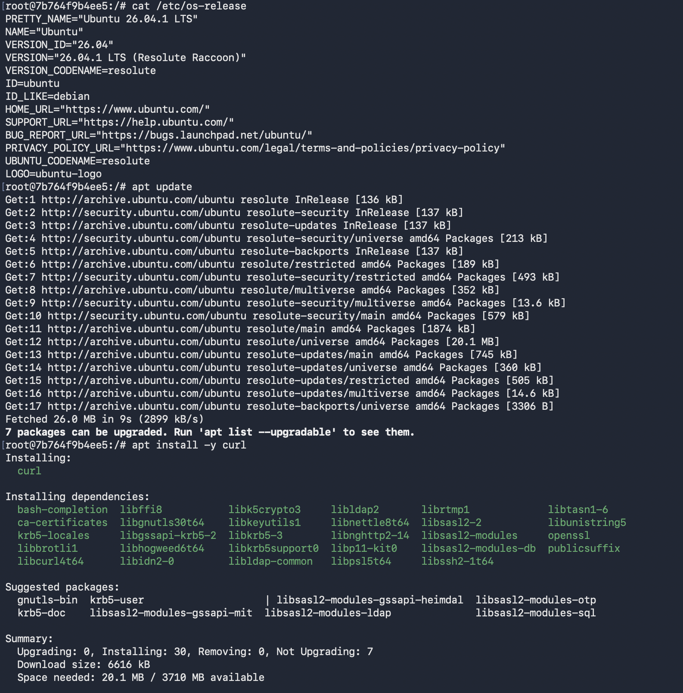

Установка была проверена командой:

```bash
curl --version
```

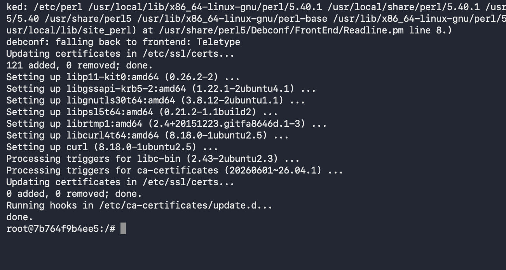

После выхода контейнер перестал выполняться, так как основной процесс `bash` завершился. Это видно при сравнении вывода `docker ps` и `docker ps -a`.

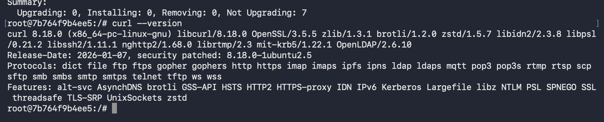

### 3. Запуск веб-сервера nginx

На сервере уже используется основной nginx на портах 80 и 443, поэтому для лабораторной работы был запущен отдельный контейнер с привязкой к локальному порту `18080`.

Команда запуска:

```bash
docker run -d \
  --name lab1-web-server \
  --label lab=devops-lab1 \
  -p 127.0.0.1:18080:80 \
  nginx:alpine
```

Таким образом, порт `80` внутри контейнера был связан с портом `18080` на сервере.

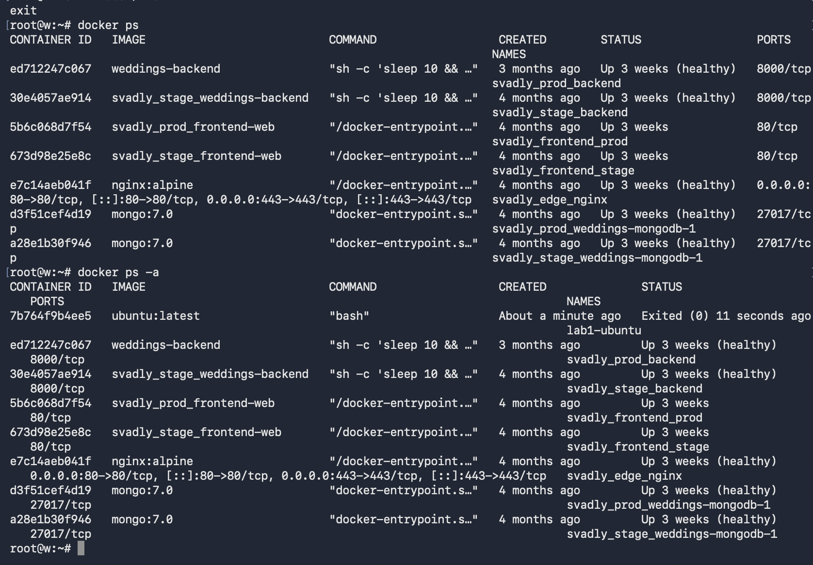

Работа веб-сервера была проверена HTTP-запросом с сервера:

```bash
curl http://127.0.0.1:18080
```

В ответ была получена стандартная страница `Welcome to nginx!`.

После этого были просмотрены логи контейнера:

```bash
docker logs lab1-web-server
```

В логах отображается успешный HTTP-запрос с кодом ответа `200`.

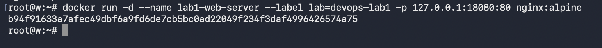

### 4. Подключение к контейнеру nginx

Для подключения внутрь работающего контейнера использовалась команда:

```bash
docker exec -it lab1-web-server sh
```

Внутри контейнера была проверена версия nginx:

```bash
nginx -v
```

Также было просмотрено содержимое директории стандартной веб-страницы:

```bash
ls -la /usr/share/nginx/html
cat /usr/share/nginx/html/index.html
```

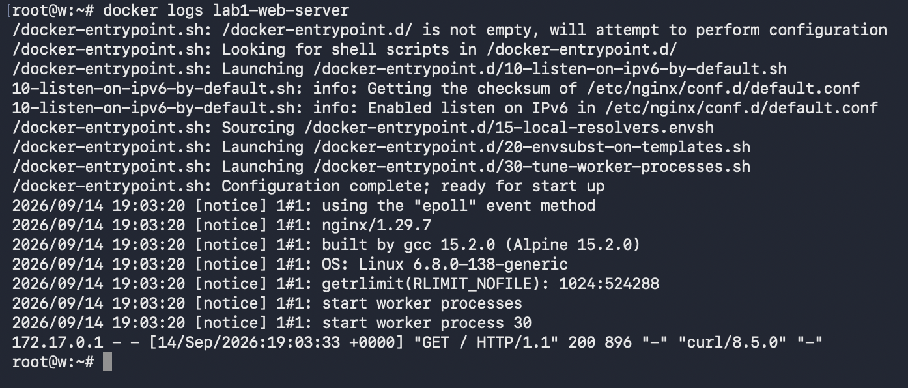

### 5. Управление контейнерами

Для проверки основных команд управления контейнер `lab1-web-server` был остановлен:

```bash
docker stop lab1-web-server
```

После остановки он исчез из вывода:

```bash
docker ps
```

но остался в списке всех контейнеров:

```bash
docker ps -a
```

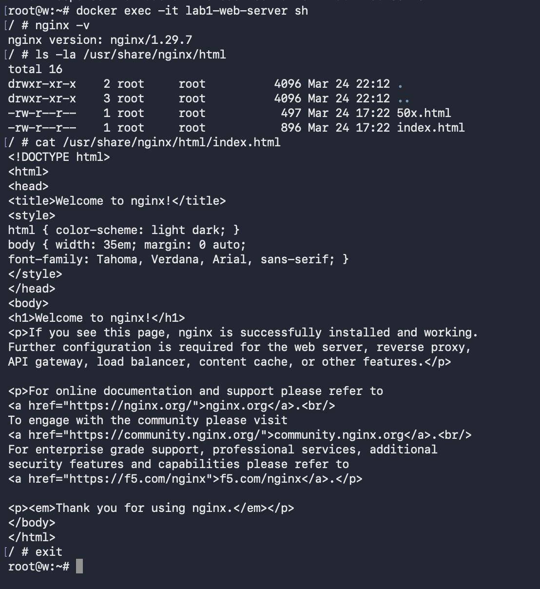

После проверки контейнер был удален:

```bash
docker rm lab1-web-server
```

Для подтверждения удаления использовалась команда:

```bash
docker ps -a --filter name=lab1-web-server
```

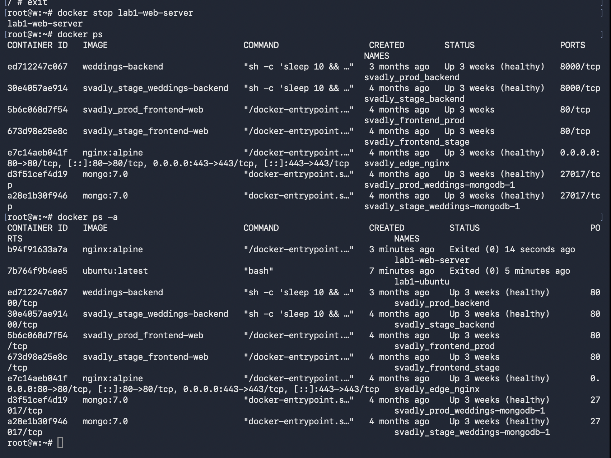

### 6. Работа с образами

Основной образ `nginx:alpine` уже использовался другим приложением на сервере, поэтому удалять его было нельзя.

Для безопасной проверки команды удаления образа был создан дополнительный тег:

```bash
docker tag nginx:alpine lab1-nginx:alpine
```

После этого были видны два тега одного и того же образа:

```bash
docker images | grep nginx
```

Дополнительный тег был удален:

```bash
docker rmi lab1-nginx:alpine
```

При этом исходный `nginx:alpine` остался на сервере и продолжил использоваться рабочим приложением.

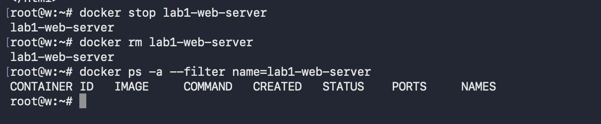

### 7. Работа с Docker Volumes

Для проверки сохранения данных вне жизненного цикла контейнера был создан Docker Volume:

```bash
docker volume create lab1-my-volume
```

Наличие тома было проверено командой:

```bash
docker volume ls | grep lab1
```

После этого был запущен отдельный Ubuntu-контейнер с подключенным томом в директорию `/data`.

Внутри контейнера был создан файл:

```bash
echo "Hello from volume" > /data/test.txt
```

и проверено его содержимое:

```bash
cat /data/test.txt
```

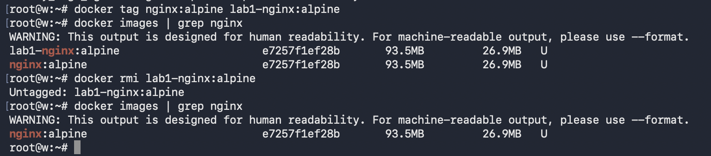

После завершения работы контейнер можно удалить и создать новый контейнер с подключением того же Docker Volume. Данные в томе сохраняются независимо от контейнера, поэтому файл `/data/test.txt` остается доступным.

На скриншоте также видно выполнение задания с тестовым контейнером для тома.

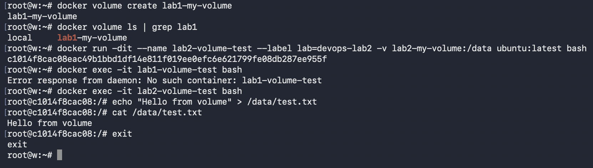

## Результат работы

В ходе лабораторной работы были выполнены основные операции с Docker:

- проверена установка и работоспособность Docker;
- запущен тестовый контейнер `hello-world`;
- изучены команды `docker images`, `docker ps` и `docker ps -a`;
- запущен интерактивный Ubuntu-контейнер;
- внутри контейнера установлен пакет `curl`;
- запущен отдельный контейнер с nginx;
- просмотрены логи nginx;
- выполнено подключение внутрь работающего контейнера;
- проверены команды остановки и удаления контейнеров;
- выполнена безопасная проверка удаления тега Docker-образа;
- создан Docker Volume и проверена возможность хранения данных независимо от контейнера.

## Вывод

В результате выполнения лабораторной работы я познакомился с основными сущностями Docker: образами, контейнерами и томами. На практике были изучены основные команды запуска, остановки, удаления и просмотра состояния контейнеров.

Также было наглядно показано, что Docker позволяет запускать на одном сервере несколько изолированных сервисов. При выполнении лабораторной работы отдельные тестовые контейнеры работали параллельно с уже существующими приложениями и не мешали их работе.
