# Отчет по Lab2 студента группы U4225 Михно Андрея
Студент: Mikhno Andrei  
Lab: Lab2  
Date of create: 12.09.2026  
Date of finished: -

## Цель работы

Научиться настраивать CI/CD-пайплайн для Docker-приложения: автоматически собирать Docker-образ, публиковать его в Docker Hub и выполнять шаг деплоя после изменений в основной ветке репозитория.

## Ход работы

### 1. Подготовка приложения

Для лабораторной работы был создан новый проект `lab2`. В проект добавлено простое Flask-приложение, файл зависимостей, `Dockerfile` и `.dockerignore`.

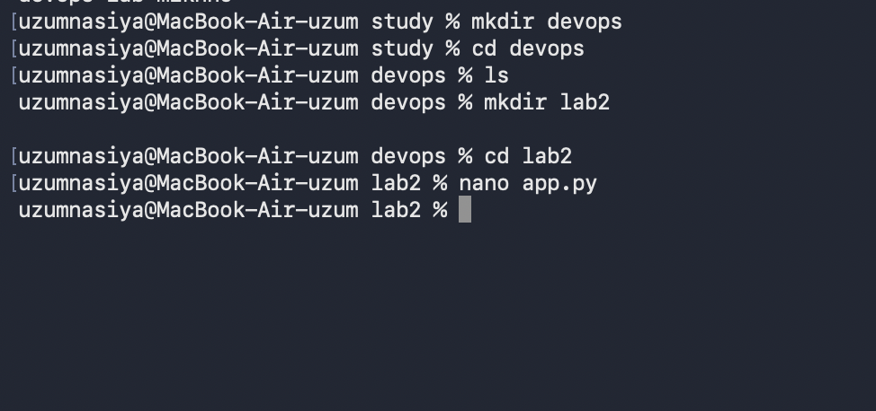


Для контейнеризации приложения был подготовлен `Dockerfile` на основе образа Python 3.12 slim. В контейнер копируются зависимости и исходный файл приложения, после чего Flask запускается на порту 5000.

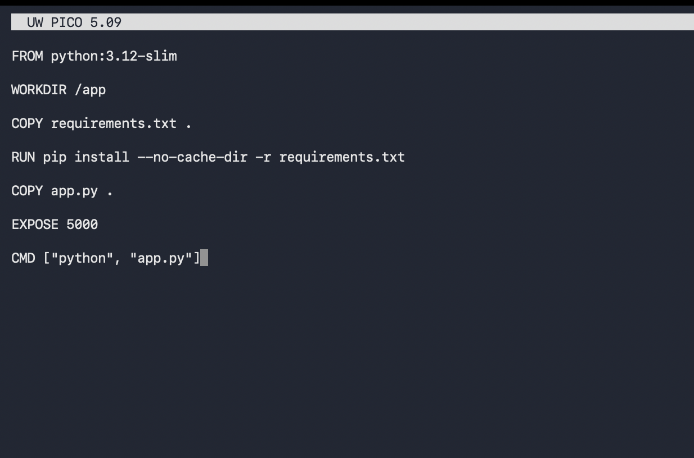


После подготовки проекта была проверена его структура.


*Рисунок 3 — Структура файлов проекта*

### 2. Локальная сборка и запуск Docker-образа

Перед настройкой CI/CD образ был собран локально командой:

```bash
docker build -t lab2-app .
```

Сборка завершилась успешно, после чего образ появился в списке локальных Docker-образов.

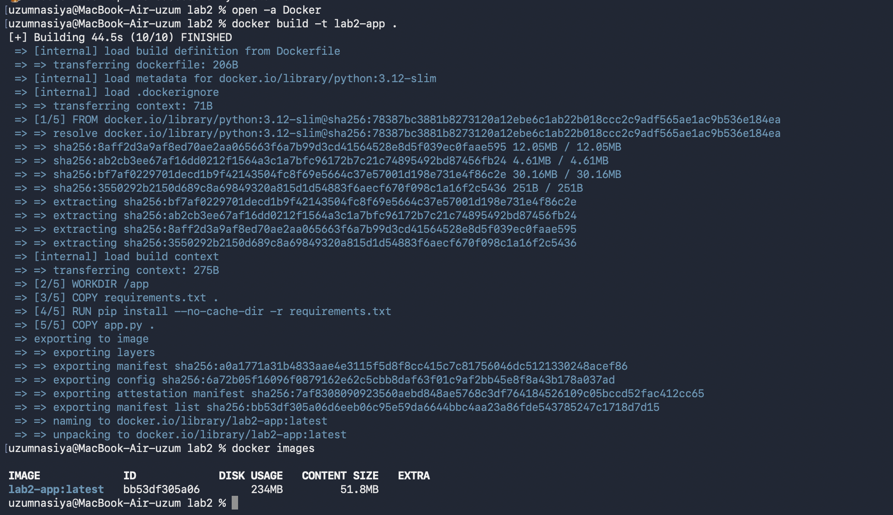


Контейнер был запущен с пробросом порта 5000. Команда `docker ps` показала, что контейнер находится в состоянии `Up`.

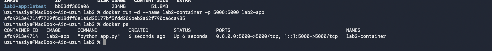


Работа приложения была проверена в браузере по адресу `localhost:5000`.

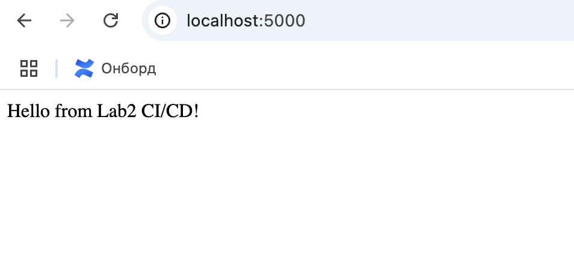


### 3. Создание репозитория GitHub

Проект был сохранен в отдельный GitHub-репозиторий `lab2`. В основную ветку `main` были добавлены исходный код приложения, Dockerfile и остальные необходимые файлы.

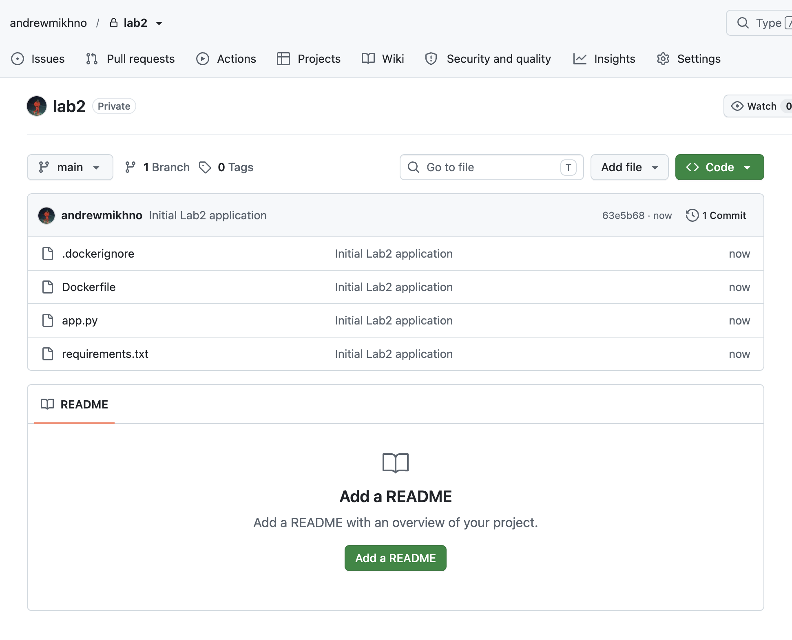


### 4. Создание репозитория в Docker Hub

В Docker Hub был создан публичный репозиторий `mikhno52/my-flask-app`, предназначенный для хранения собранного Docker-образа.

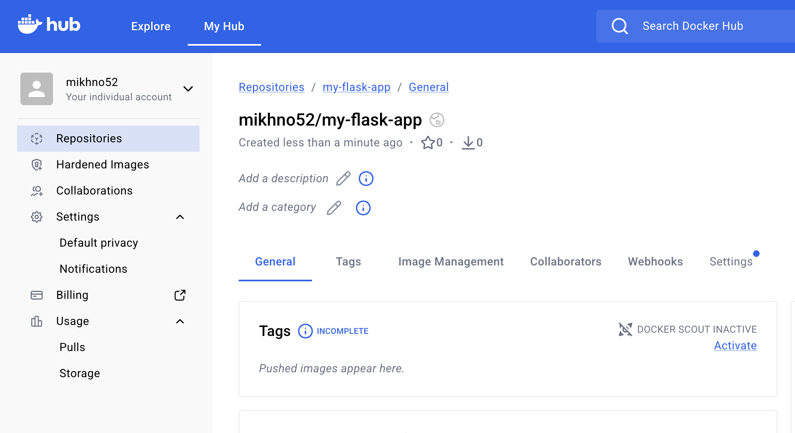


### 5. Настройка секретов GitHub Actions

Для безопасной авторизации в Docker Hub в настройках GitHub-репозитория были добавлены два секрета:

- `DOCKER_USERNAME` — логин Docker Hub;
- `DOCKER_PASSWORD` — токен доступа Docker Hub.

Значения секретов не хранятся непосредственно в workflow-файле.

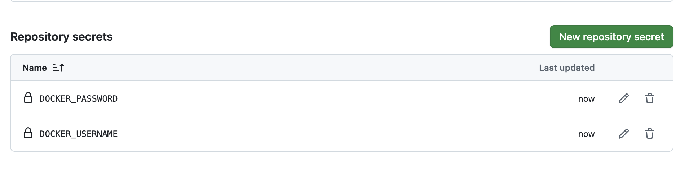


### 6. Настройка GitHub Actions

В проекте была создана директория `.github/workflows` и файл `docker-build.yml`.

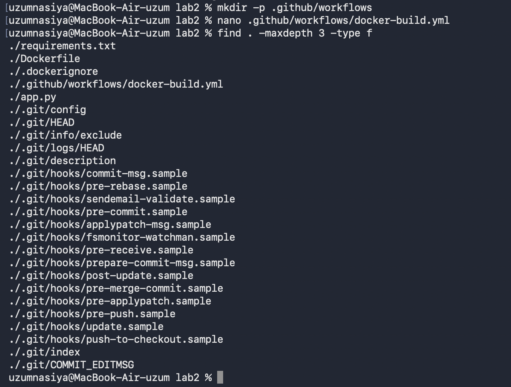


Пайплайн настроен на запуск при каждом push в ветку `main`. Он выполняет следующие действия: получает исходный код, настраивает Docker Buildx, выполняет авторизацию в Docker Hub, собирает и публикует образ `mikhno52/my-flask-app:latest`, после чего выполняет шаг деплоя с выводом сообщения.

### 7. Запуск CI/CD-пайплайна

После добавления workflow-файла был выполнен commit и push в ветку `main`. Это автоматически запустило GitHub Actions.

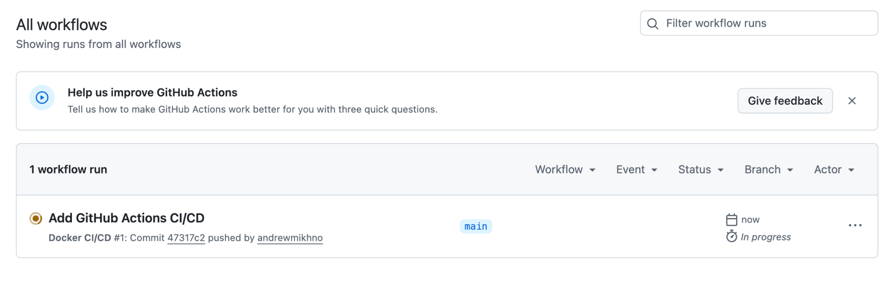


Пайплайн завершился успешно. Job `build-and-push` был выполнен без ошибок, Docker-образ был собран и опубликован.

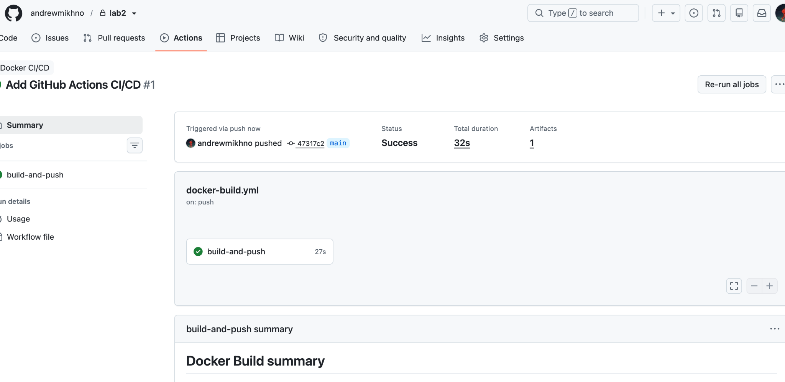


### 8. Проверка публикации образа

После завершения GitHub Actions в Docker Hub появился тег `latest`, что подтверждает успешную автоматическую публикацию образа.

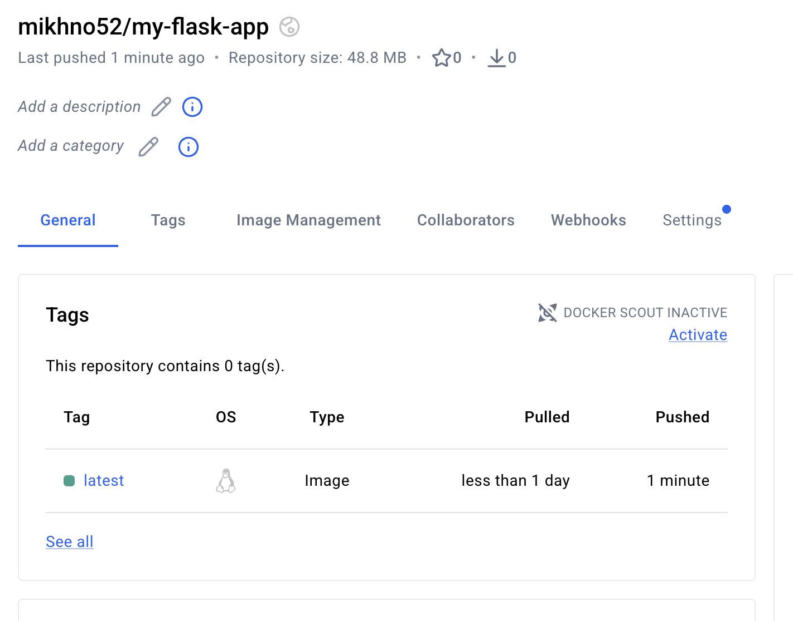

## Результат работы

В ходе лабораторной работы было создано и проверено простое Flask-приложение в Docker-контейнере. Для проекта настроен CI/CD-пайплайн в GitHub Actions, который автоматически запускается при push в ветку `main`, собирает Docker-образ и публикует его в Docker Hub.

Для авторизации используются GitHub Secrets, поэтому логин и токен Docker Hub не хранятся в открытом виде в репозитории. После выполнения пайплайна образ `mikhno52/my-flask-app:latest` успешно появился в Docker Hub.

## Вывод

В результате выполнения Lab2 была изучена базовая настройка CI/CD для Docker-приложения с использованием GitHub Actions и Docker Hub. Была проверена вся цепочка: изменение кода → push в GitHub → автоматическая сборка образа → публикация образа в Docker Hub → выполнение шага деплоя.
