# Отчет по Lab3 студента группы U4225 Михно Андрея
Студент: Mikhno Andrei  
Lab: Lab3  
Date of create: 15.09.2026  
Date of finished: -

## Цель работы

Научиться настраивать систему мониторинга с использованием Prometheus и Grafana, собирать системные метрики с сервера и отображать их в виде графиков на дашборде.

## Ход работы

### 1. Подготовка окружения

Для выполнения лабораторной работы на виртуальном сервере была создана отдельная директория `lab3` и папка `prometheus` для конфигурации системы мониторинга. Перед началом работы также было проверено текущее состояние Docker-контейнеров на сервере.

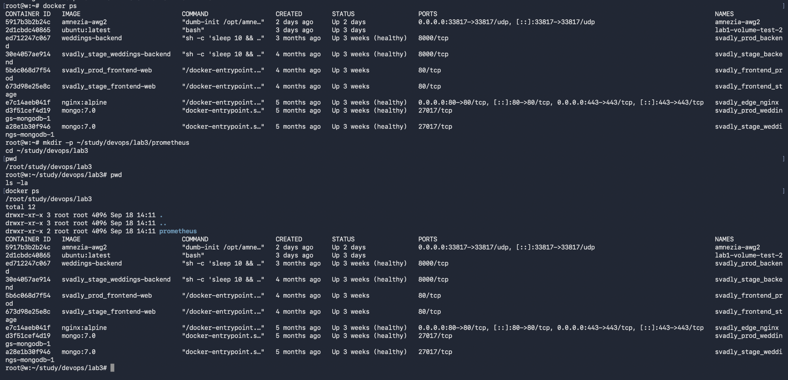

### 2. Настройка Prometheus

В директории `prometheus` был создан конфигурационный файл `prometheus.yml`. В нем был установлен интервал сбора метрик 15 секунд и добавлены два источника: сам Prometheus и Node Exporter.

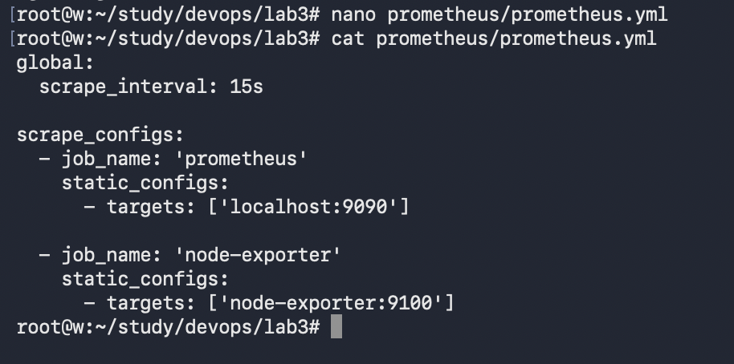

Для взаимодействия контейнеров была создана отдельная Docker-сеть `monitoring`.

### 3. Запуск Node Exporter

Для сбора системных метрик виртуального сервера был запущен контейнер Node Exporter. Контейнер подключен к сети `monitoring` и использует порт 9100.

После запуска была выполнена проверка endpoint `/metrics`. В ответ были получены системные метрики, что подтверждает корректную работу Node Exporter.

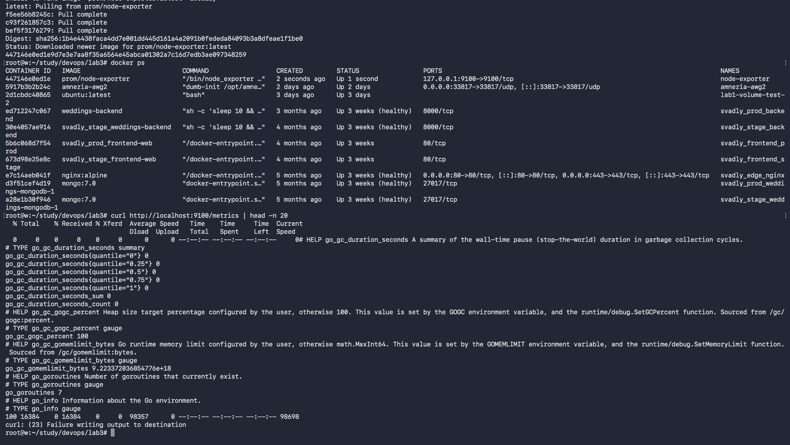

### 4. Запуск Prometheus

Для хранения данных Prometheus был создан отдельный Docker volume. Затем был запущен контейнер Prometheus с подключением конфигурационного файла и сети `monitoring`.

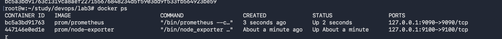

Готовность Prometheus была дополнительно проверена через встроенный endpoint состояния.

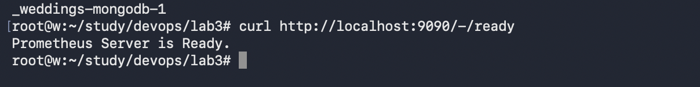

### 5. Проверка сбора метрик

В веб-интерфейсе Prometheus была открыта страница Target health. Оба настроенных источника — `prometheus` и `node-exporter` — находятся в состоянии `UP`.

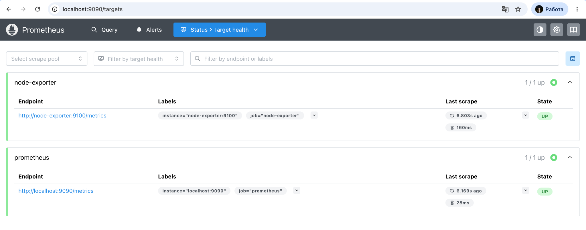

Для дополнительной проверки был выполнен запрос к метрике `node_cpu_seconds_total`. Prometheus успешно получил данные Node Exporter и построил график.

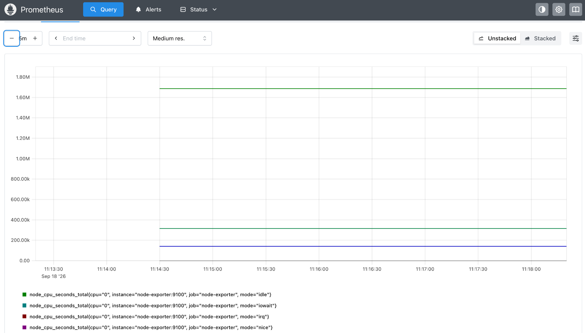

### 6. Запуск Grafana

Для Grafana был создан отдельный Docker volume, после чего контейнер был запущен в той же сети `monitoring`. В результате одновременно работали три основных компонента системы мониторинга: Node Exporter, Prometheus и Grafana.

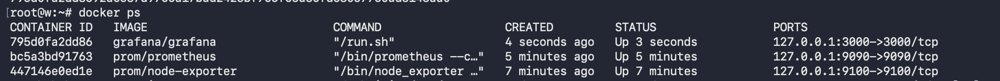

### 7. Подключение Prometheus к Grafana

В Grafana был добавлен Prometheus в качестве источника данных. Для подключения использовался адрес контейнера Prometheus внутри общей Docker-сети.

Проверка соединения завершилась успешно, Grafana смогла обратиться к Prometheus API.

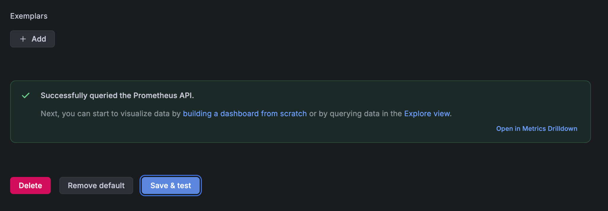

### 8. Создание дашборда

В Grafana был создан дашборд с несколькими панелями для отображения различных системных метрик. На графиках отображаются показатели загрузки CPU, памяти и дискового пространства, а также исходные метрики процессора.

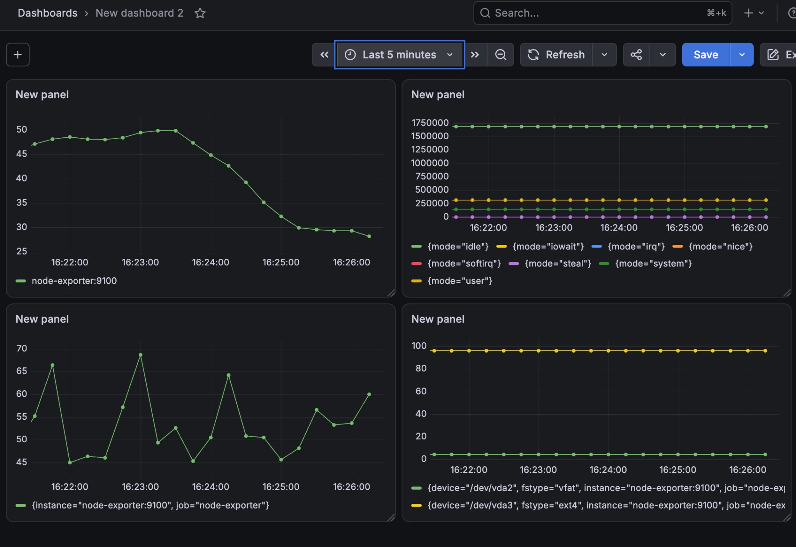

### 9. Финальная проверка системы

После завершения настройки была повторно проверена работа контейнеров. Grafana, Prometheus и Node Exporter находятся в состоянии `Up`.

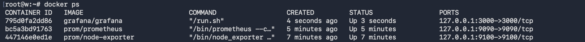

Также была проверена Docker-сеть `monitoring`, которая используется для взаимодействия всех компонентов системы.

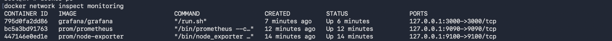

## Результат работы

В ходе лабораторной работы была развернута система мониторинга на базе трех Docker-контейнеров. Node Exporter собирает системные метрики виртуального сервера, Prometheus получает и хранит эти данные, а Grafana использует Prometheus как источник данных и отображает показатели в виде графиков.

Работа системы была проверена через интерфейс Prometheus, страницу Target health и дашборд Grafana. Все основные компоненты успешно взаимодействуют друг с другом через Docker-сеть `monitoring`.

## Вывод

В результате выполнения Lab3 была изучена базовая настройка мониторинга с использованием Prometheus, Node Exporter и Grafana. Были настроены сбор системных метрик, хранение данных и их визуализация. Созданный дашборд позволяет наблюдать за состоянием CPU, памяти и дискового пространства виртуального сервера.
